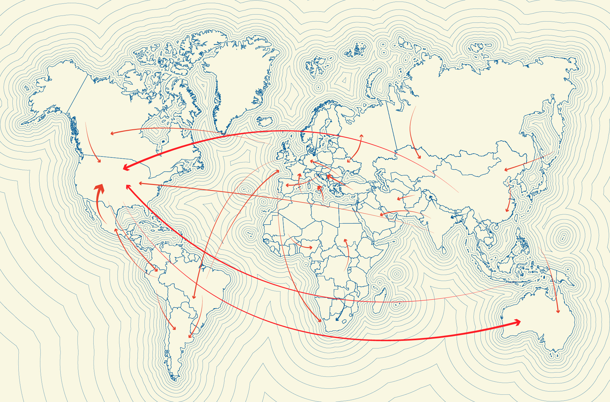

<h1> Vadecum</h1>
<h2> A guide  </h2>

    Main idea is to complete a series of small booklets to be used as guide for each country. What I mean with that?
    Image you just want to travel to another country, maybe youll need several website to update yourself for what you need in order to fit this new destination or maybe to get to know what takes to get a simple documentation. In resume, a guide for the main points of a country topics and questions, what to expect and eventually what documents are need to live there. 

-[x] Introduction
-   [ ] Resume the idea
-    [ ] Working in a Template
        [] Introduce the main point in a vadecum
        []
    [ ] Languages 
        [x] Italian
        [x] Portuguese
        [ ] English
        [ ] Spanish
        [ ] Outros...
    [ ] Separate the languages in each fork?
    [ ] Issue Tracking
    [ ] Languages translation
    [ ] Linking resources
    [ ] Anchor 
    

    Would be wonderful to see in the future this used to welcome new travelers and see this as a main guide to know another country, beside wikipedia. The beutiful from a open source project is that a small act from a single person is undervalued when eventually small acts and contribute are done. 

<blockquote>Empowerment of individuals is a key part of what makes open source work, since in the end, innovations tend to come from small groups, not from large, structured efforts. -Tim O'Reilly</blockquote>

This main idea came when I start to look the vademecum from Italy, there you can find an extense and well ogranized file for what you need to in order to live there, you can find some other example in the 
 

and a beutiful open source project called, guia vadecum 

<table border="0">
 <tr>
    <td><b style="font-size:20px">/ va de mè cum /</b></td>
    <td><b style="font-size:20px">Objective</b></td>
 </tr>
 <tr>
    <td> 
        s. m. {noun use of the loc. latina vade mecum "go, come with me"}. Name of a small-format, pocket-sized volume containing a handbook of notions relating to a specific topic.
        vadem & cum</td>
    <td>it is a guide to orient oneself in the contemporary history of human migration and to get to know the world of hospitality more closely. The project is open source: anyone who wants to contribute to making it grow, to propose new ideas and topics or express criticisms, suggestions or corrections is more than welcome!
    </td>
 </tr>
</table> 

